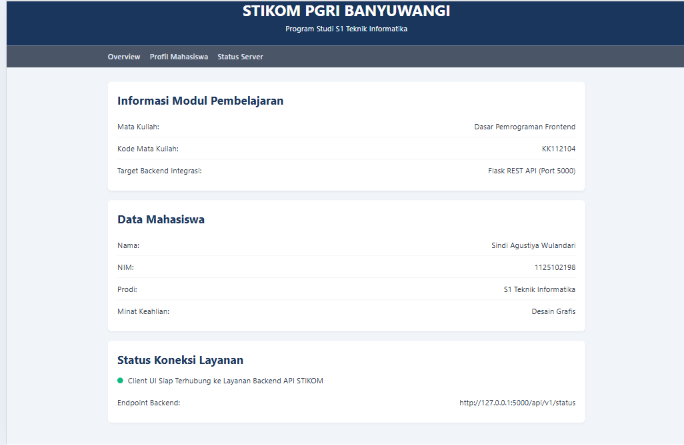
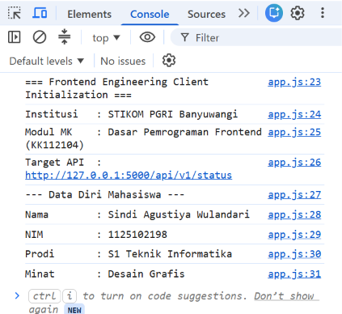

# Frontend Pertemuan 1 - Profil Mahasiswa

Tugas Praktikum 1 mata kuliah **Dasar Pemrograman Frontend (KK112104)**
STIKOM PGRI Banyuwangi.

## Deskripsi

Antarmuka statis (HTML, CSS, JavaScript) yang menampilkan profil mahasiswa
dan status koneksi ke layanan backend Flask. Dibangun menggunakan elemen
HTML5 semantic, CSS Variables, dan layout Flexbox/Grid.

## Struktur Berkas

```
frontend-pertemuan-1/
├── index.html
├── assets/
│   ├── css/
│   │   └── style.css
│   └── js/
│       └── app.js
├── .gitignore
└── README.md
```

## Cara Menjalankan

1. Clone repositori ini.
2. Buka `index.html` langsung di browser, atau jalankan lewat live server.
3. Buka Developer Console (F12) untuk melihat log data diri mahasiswa dan
   endpoint backend yang dituju.

## Target Backend

Endpoint yang menjadi target integrasi: `http://127.0.0.1:5000/api/v1/status`

## Hasil Uji

ini adalah tampilannya


ini console log:


## Penulis

Sindi Agustiya Wulandari — 1125102198 — S1 Teknik Informatika